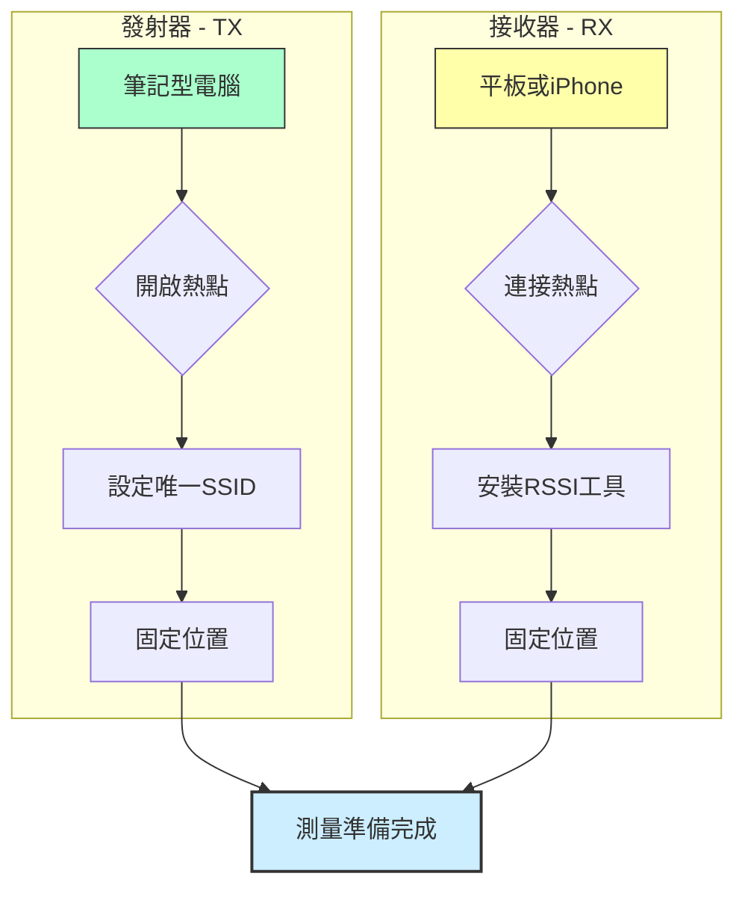

## Wireless Sensing for Human Activity
ref:[Wireless Sensing for Human Activity](https://ieeexplore.ieee.org/document/8794643)
### introduction

|Technique|Core Measurement| Metric|Signal Granularity|Drawbacks|
|---------|----------------|---------|----------------------|--------
|RSSI-based|Received Signal Strength Indicator|Coarse-grained |Prone to noise/interference| unstable; only detects limited activity types.|
|CSI-based|Channel State Information (Amplitude & Phase)|Fine-grained |Requires modified driver |software on specific NICs (e.g., Intel 5300).|
|FMCW-based|,Frequency Shift (related to depth/distance)|Fine-grained |Measures Time of Flight (ToF) by mapping time differences to frequency shifts| requires specialized hardware to sweep carrier frequency|.
|Doppler Shift-based|Frequency Shift (related to moving speed v)|Fine-grained |Measures the frequency change of the received signal due to relative motion between the reflector (human body) and the receiver.|

### Key Application Areas
The technology is broadly applied across four categories:
1.Intrusion Detection & Occupancy Monitoring
- Intrusion: Detects human entry by sensing the sudden RSSI/CSI changes caused by disturbances in the link.
- Occupancy: Monitors crowd density, as more people cause greater signal attenuation and RSSI drops.
  
2.Activity & Gesture Recognition
- Activity: Recognizes daily routines (e.g., walking, cooking, washing dishes) based on unique RSSI/CSI patterns caused by distinct body movements.
- Gesture: Recognizes smaller motions (hand/finger/head movements) for HCI. CSI is required for subtle gestures due to its fine granularity.
  
3.Vital Signs Monitoring
- Detects minute body vibrations associated with breathing and heart rates. CSI and FMCW are often preferred for accurate monitoring due to their higher sensitivity.
  
4.User Identification & Localization
- Identification: Identifies individuals by sensing their unique physiological and behavioral characteristics, primarily through walking gait patterns captured by CSI.
- Localization: Uses RSSI and CSI fingerprints to estimate device-free indoor locations.

### RSSI detection(a simple test)

####  Received Signal Strength Indicator (RSSI) in static indoor environments VS dynamic (pedestrian) indoor environments.
```
#!/bin/bash

# --- 參數設定 ---
INTERFACE="wlp1s0"  # 您的無線網卡介面名稱
BSSID="78:44:76:dc:ef:08"
OUTPUT_FILE=""     # 輸出檔案名稱將在運行時設定
INTERVAL=0.1       # 數據採集間隔，1 秒 (1 Hz)
# -----------------

if [ -z "$1" ]; then
    echo "使用方法: $0 <輸出檔案名稱> [秒數]"
    exit 1
fi

OUTPUT_FILE="$1"
DURATION=${2:-0} # 如果未指定秒數，則設為 0 (無限)

echo "Timestamp,RSSI_dBm" > "$OUTPUT_FILE"
echo "開始記錄 RSSI 數據到 $OUTPUT_FILE..."
START_TIME=$(date +%s)

while true
do
    # 檢查是否達到設定的持續時間
    if [ "$DURATION" -gt 0 ]; then
        CURRENT_TIME=$(date +%s)
ELAPSED=$((CURRENT_TIME - START_TIME))
        if [ "$ELAPSED" -ge "$DURATION" ]; then
            break
        fi
    fi

    # 擷取 RSSI 數據
    RSSI=$(sudo iw dev "$INTERFACE" link 2>/dev/null | grep "signal:" | awk '{p>
    
    # 檢查是否成功擷取 RSSI
    if [ ! -z "$RSSI" ]; then
        TIMESTAMP=$(date +%s)
        echo "$TIMESTAMP,$RSSI" >> "$OUTPUT_FILE"
    fi
    
    # 等待設定的間隔時間
    sleep "$INTERVAL"
done
echo "數據採集結束。"
```
- in static indoor


- in dynamic indoor(1 person walking around)


### CSI detection
CSI provides more fine-grained channel information (i.e., both amplitude and phase information)with multiple subcarriers.

Based on this theis,CSI detection require profession SDR equipment.

But in OAI,we can generate 5G CSI , then detect whether the CSI changes.
If the CSI changes significantly, interpret it as an event such as human movement or presence.

1.dump
we need to find `void nr_pusch_channel_estimation` to get the CSI.
```
#include <stdio.h>
static FILE *fp_h = NULL;
```
```
# open a file to store the data
if (fp_h == NULL) {
    fp_h = fopen("/tmp/h_est_dump.csv", "w");
}
```

```
# Write the file where H_est is estimated.
fprintf(fp_h, "%d,%d,%f,%f\n",
        ant, k,
        creal(H_est[ant][k]),
        cimag(H_est[ant][k])
);
```

```
#rerun the OAI code
source oaienv
cd cmake_targets/
./build_oai --gNB --nrUE -w SIMU

```
