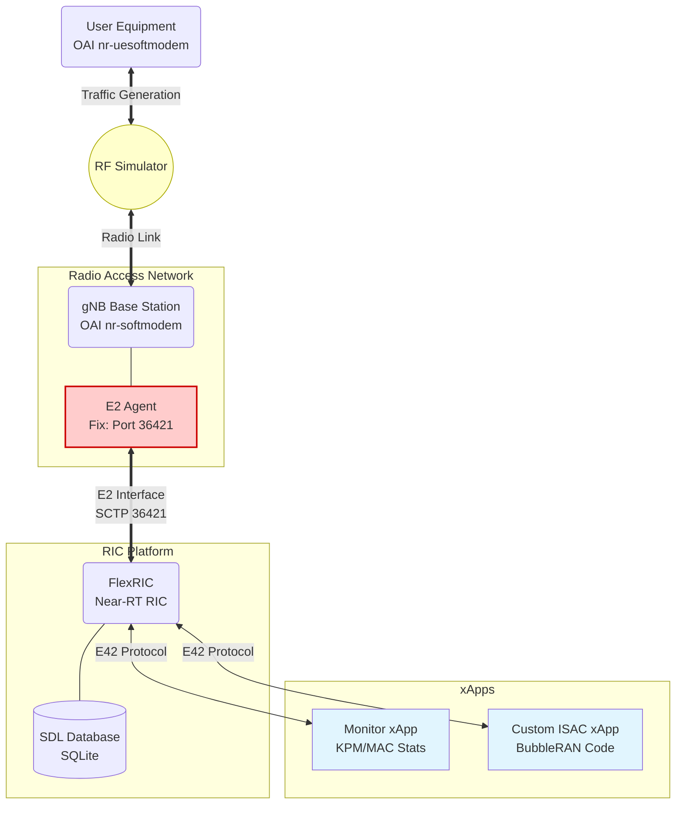
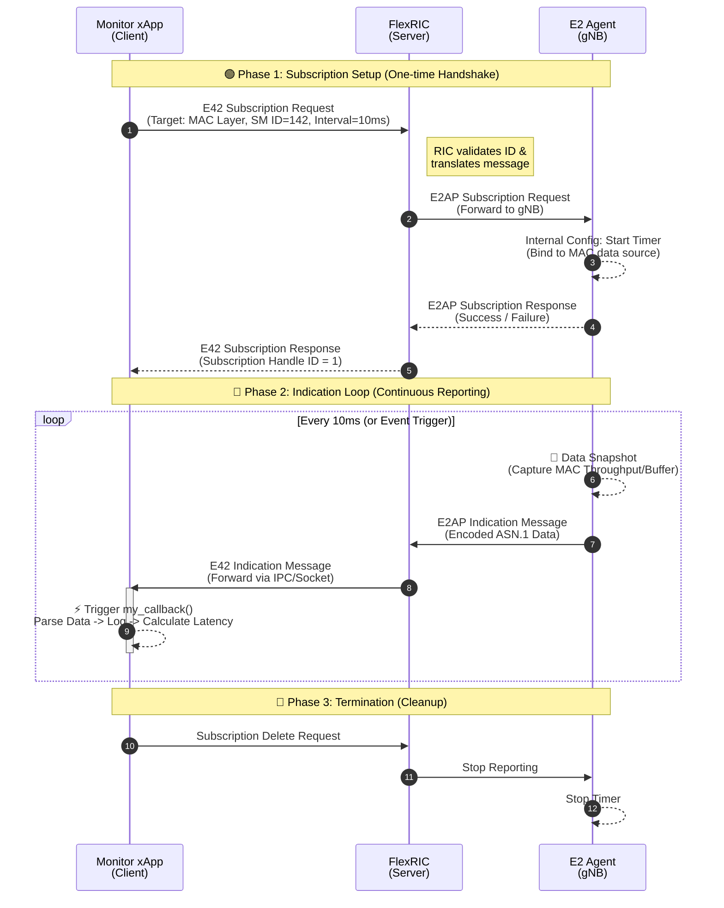

# ISAC Xapp

✅ action item: from chei-chun 
-
- trace the code in both oai and Flexric 
- the newest version of FlexRIC for ISAC function .——> it needs the private repository,requires Eurecom Gitlab account.
  
REF:

[bubble ran xapp-programing](https://bubbleran.com/docs/devops-guide/flexric/developers-guide/xapp/xapp-programming/usr)

[bubble ran xapp-train-lab10 : isac](https://bubbleran.com/docs/user-guide/xapp-training/lab10)

[behining the ISAC](https://docs.google.com/presentation/d/1N7rEccMr3gYtHP5ud3Wo_UydceQRh-IQ/edit?slide=id.g33d3e013c19_0_27#slide=id.g33d3e013c19_0_27)

## Flow between oai-gnb and flexRIC 


##  FlexRIC
```
:~/flexric/build/examples/ric$ ./nearRT-RIC
```
confirm the message can go through from gnb to flexRIC
```
[iApp]: nearRT-RIC IP Address = 127.0.0.1, PORT = 36422
[NEAR-RIC]: Initializing Task Manager with 2 threads 
[E2AP]: E2 SETUP-REQUEST rx from PLMN   1. 1 Node ID 3584 RAN type ngran_gNB
[NEAR-RIC]: Accepting RAN function ID 2 with def = ORAN-E2SM-KPM 
[NEAR-RIC]: Accepting RAN function ID 3 with def = ORAN-E2SM-RC 
[NEAR-RIC]: Accepting RAN function ID 142 with def = MAC_STATS_V0 
[NEAR-RIC]: Accepting RAN function ID 143 with def = RLC_STATS_V0 
[NEAR-RIC]: Accepting RAN function ID 144 with def = PDCP_STATS_V0 
[NEAR-RIC]: Accepting RAN function ID 145 with def = SLICE_STATS_V0 
[NEAR-RIC]: Accepting RAN function ID 146 with def = TC_STATS_V0 
[NEAR-RIC]: Accepting RAN function ID 148 with def = GTP_STATS_V0 
[iApp]: E42 SETUP-REQUEST rx
[iApp]: E42 SETUP-RESPONSE tx
[iApp]: SUBSCRIPTION-REQUEST RAN_FUNC_ID 142 RIC_REQ_ID 1 tx 
[iApp]: SUBSCRIPTION-REQUEST RAN_FUNC_ID 143 RIC_REQ_ID 2 tx 
[iApp]: SUBSCRIPTION-REQUEST RAN_FUNC_ID 144 RIC_REQ_ID 3 tx 
[iApp]: SUBSCRIPTION-REQUEST RAN_FUNC_ID 148 RIC_REQ_ID 4 tx 
[NEAR-RIC]: SUBSCRIPTION DELETE REQUEST tx RAN FUNC ID 142 RIC_REQ_ID 1021 

```

## Monitor Xapp
I use the monitor xapp to familiar with the subscription and indication part.

The Monitor xApp (xapp_gtp_mac_rlc_pdcp_moni) is the standard reference application in FlexRIC. It serves as a "dashboard" for the RAN, simultaneously subscribing to multiple protocol layers (MAC, RLC, PDCP, GTP) to gather real-time statistics.

check the status and calculate the latency . 
```
 Registered node 0 ran func id = 146 
 Registered node 0 ran func id = 148 
 [xApp]: E42 RIC SUBSCRIPTION REQUEST tx RAN_FUNC_ID 142 RIC_REQ_ID 1 
[xApp]: SUBSCRIPTION RESPONSE rx
[xApp]: Successfully subscribed to RAN_FUNC_ID 142 
[xApp]: E42 RIC SUBSCRIPTION REQUEST tx RAN_FUNC_ID 143 RIC_REQ_ID 2 
[xApp]: SUBSCRIPTION RESPONSE rx
[xApp]: Successfully subscribed to RAN_FUNC_ID 143 
[xApp]: E42 RIC SUBSCRIPTION REQUEST tx RAN_FUNC_ID 144 RIC_REQ_ID 3 
[xApp]: SUBSCRIPTION RESPONSE rx
[xApp]: Successfully subscribed to RAN_FUNC_ID 144 
MAC ind_msg latency = 378 μs
```

## ISAC Xapp
From bubble RAN　lab10, we can get a code for ISAC Xapp:
```
## xapp_isac_srs.c
#include "../include/src/xApp/e42_xapp_api.h"
#include "../include/src/util/alg_ds/alg/defer.h"
#include "../include/src/util/time_now_us.h"
#include "../include/src/sm/isac_sm/isac_sm_id.h"
#include <poll.h>
#include <stdio.h>

void cb(sm_ag_if_rd_t const *rd, global_e2_node_id_t const *n)
{
  assert(n != NULL);
  assert(rd != NULL);
  assert(rd->type == INDICATION_MSG_AGENT_IF_ANS_V0);
  assert(rd->ind.type == ISAC_STATS_V0);

  isac_ind_data_t const* ind = &rd->ind.isac;
  isac_ind_msg_t const* msg = ind->msg; // needed for flexible array member
  printf("Timestamp %ld latency %ld \n", msg->tstamp, time_now_us() - msg->tstamp);
  printf("len_srs_iq %lu \n", msg->len_srs_iq);

//  int16_t const* srs_iq = msg->srs_iq;
  for(size_t i = 0; i < msg->len_srs_iq; ++i){
//    printf("re %d im %d noise_re %d noise_im %d \n",srs_iq[4*i], srs_iq[4*i+1], srs_iq[4*i+2], srs_iq[4*i+3]);
  }
}

static
isac_sub_data_t gen_isac_sub_data(void)
{
  isac_sub_data_t dst = {0};
  dst.et.type = APERIODIC_ISAC_EVENT;
  dst.et.aper = SRS_ISAC_EVENT_TRIGGER_APER;

  return dst;
}

int main(int argc, char *argv[])
{
  assert(argc == 2);

  //Init the xApp
  init_xapp_api(argv[1]);
  poll(NULL, 0, 1000);

  e2_node_arr_xapp_t arr = e2_nodes_xapp_api();
  defer({ free_e2_node_arr_xapp(&arr); });

  assert(arr.len > 0);
  sm_ans_xapp_t* hndl = calloc(arr.len, sizeof(sm_ans_xapp_t));
  defer({ free(hndl); });

  // Generate RAN CONTROL Subscription
  isac_sub_data_t isac_sub = gen_isac_sub_data();
  defer({ free_isac_sub_data(&isac_sub); });

  // Retrieve information about the E2 Nodes in the callback func (cb)
  for(size_t i = 0; i < arr.len; ++i){
    hndl[i] = report_sm_xapp_api(&arr.n[i].id, SM_ISAC_ID, &isac_sub, cb);
    assert(hndl[i].success == true);
  }

  poll(NULL, 0, 2000);

  for(size_t i = 0; i < arr.len; ++i){
    rm_report_sm_xapp_api(hndl[i].u.handle);
  }

  // stop the xApp
  while(try_stop_xapp_api() == false)
    poll(NULL, 0, 1000);

  return 0;
}
```
However the public FlexRIC doesn't have`isac_sm` and it require physical equipment to get correct data.
