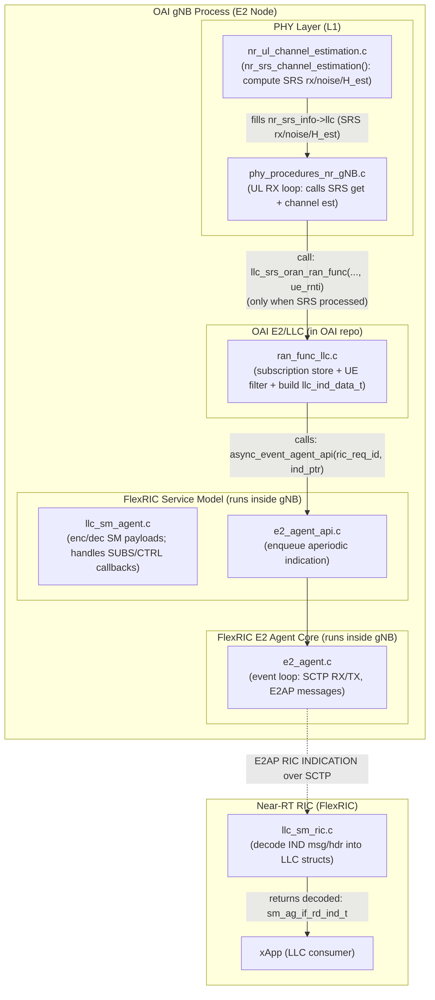
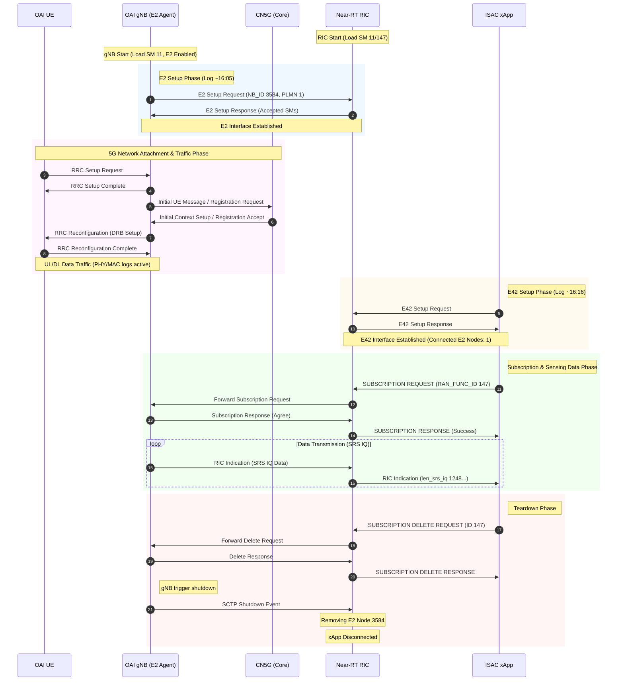
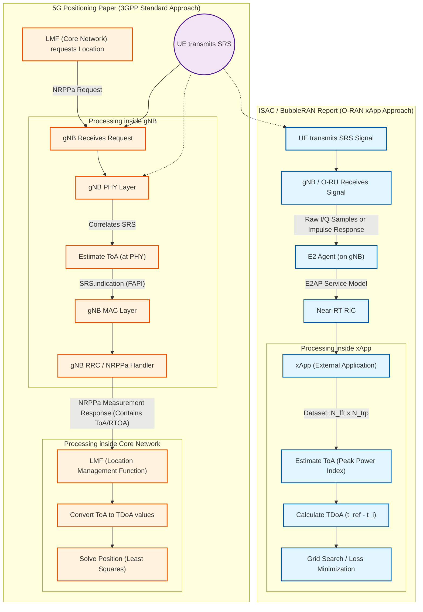

# E2SM-llc xapp

## Table of Contents

- [E2SM-llc xapp](#e2sm-llc-xapp)
  - [how xapp get the data?](#how-xapp-get-the-data)
    - [OAI SRS Output Data Structure (LLC RAN Function)](#oai-srs-output-data-structure-llc-ran-function)
  - [Test flow](#test-flow)
    - [OAI gnb](#oai-gnb)
      - [log of oai-gnb](#log-of-oai-gnb)
    - [oai-ue](#oai-ue)
      - [log of oai-ue and gnb](#log-of-oai-ue-and-gnb)
    - [Terminal1 RIC](#terminal1-ric)
    - [Terminal2 llc xapp:](#terminal2-llc-xapp)
    - [Flow chart](#flow-chart)
  - [Limitations & Issues Analysis of the Reference O-RAN TDoA Paper](#limitations--issues-analysis-of-the-reference-o-ran-tdoa-paper)
        - [Difference between two method getting TDoA](#difference-between-two-method-getting-tdoa)
    - [1. Fundamental Hardware Constraints](#1-fundamental-hardware-constraints)
    - [2. Geometric Flaws](#2-geometric-flaws)
    - [3. Algorithmic Simplifications](#3-algorithmic-simplifications)
    - [4. Comparison: Reference Paper vs. Proposed Optimization](#4-comparison-reference-paper-vs-proposed-optimization)
    - [5. Key Takeaways for Implementation](#5-key-takeaways-for-implementation)
  - [ISAC xApp: Research Goals & Technical Analysis](#isac-xapp-research-goals--technical-analysis)
    - [1. Stability of Sensing Data](#1-stability-of-sensing-data)
    - [2. Impact of Config on Sensing Resolution](#2-impact-of-config-on-sensing-resolution)
    - [3. ISAC Data Latency Support](#3-isac-data-latency-support)
  - [xapp develop](#xapp-develop)
    - [Critical Parameters Configuration](#critical-parameters-configuration)
      - [1. Physics & System](#1-physics--system)
      - [2. DSP Enhancement (Software Resolution)](#2-dsp-enhancement-software-resolution)
      - [3. Geometry Setup (Anchor Positions)](#3-geometry-setup-anchor-positions)
      - [4. Hardware Calibration](#4-hardware-calibration)
      - [5. Solver Strategy (Grid Search)](#5-solver-strategy-grid-search)
      - [6. Stability Filter (Smoothing)](#6-stability-filter-smoothing)
    - [Flowchart](#flowchart-1)
    - [test with siso(rfsim):](#test-with-sisorfsim)

## how xapp get the data?


### OAI SRS Output Data Structure (LLC RAN Function)

1. Overview

In OAI, the PHY layer calculates channel estimates based on the received SRS. If the LLC Service Model (LLC_ORAN_SM) is enabled, this data is packed into the `oran_llc_sm_raw_iq_t` structure and "pushed" to the E2 Agent via the `llc_srs_oran_ran_func` API.

Key Data Structure: `oran_llc_sm_raw_iq_t`
Definition File: `defs_nr_common.h`

The output consists of three main IQ data matrices corresponding to antennas, symbols, and subcarriers.

2. Key Parameters (IQ Data)

All IQ data is represented in c16_t format (Complex 16-bit integer), where the higher 16 bits represent the Imaginary (Q) part and the lower 16 bits represent the Real (I) part.

2.1 Received Signal (srs_received_signal)

Variable Name: srs_received_signal
Format: c16_t [Antenna_Port][Symbol][Subcarrier]
- Description:
This is the raw time/frequency domain signal received by the gNB antennas before any equalization or processing. It contains the superposition of the UE's signal, channel effects (fading, pathloss), and thermal noise.
- Usage:
Essential for xApps that want to implement custom channel estimation algorithms or machine learning models that require raw input features.

2.2. Noise Estimate (noise)

Variable Name: noise
Format: c16_t [Antenna_Port][Symbol][Subcarrier]
- Description:
represents the background noise and interference estimated by the gNB.
Note: Even though the type is c16_t, noise power is usually a scalar magnitude. In some implementations, this might be populated across the array to match dimensions, or represent noise vectors in specific resource blocks.
- Usage:
Critical for calculating the SNR (Signal-to-Noise Ratio) and SINR. It is used to determine the reliability of the channel estimate.

2.3. Estimated Channel Frequency Response 
(srs_estimated_channel_freq)

Variable Name : srs_estimated_channel_freq
Format: c16_t [Antenna_Port][Symbol][Subcarrier]
- Description:
This is the core output—the Channel Frequency Response (CFR) (H) estimated by the gNB's internal Least Squares (LS) or MMSE estimator.
- Equation logic: 
Y=H×X+N (where Y is received, X is known pilot, H is this parameter).
- Usage:
This is the most "ready-to-use" data for xApps. It describes how the wireless channel modifies the signal amplitude and phase per subcarrier, used for:
Beamforming weight calculation.
Precoding matrix selection.
Massive MIMO channel reciprocity calibration.

## Test flow
I open 4 teminal:

    Terminal1: start the nearRT-RIC
    Terminal2: LLC xApp in C
    Terminal3: OAI gnb
    Terminal4: OAI UE
    You need the [Terminal 5]to deploy CN5G. 

### OAI gnb 
1.Pre-requisites
```
### Install required packages
sudo apt update
sudo apt install -y autoconf automake build-essential ccache cmake clang cpufrequtils libblocksruntime-dev doxygen ethtool g++ git inetutils-tools libboost-all-dev libncurses-dev libusb-1.0-0 libusb-1.0-0-dev libusb-dev python3-dev python3-mako python3-numpy python3-requests python3-scipy python3-setuptools python3-ruamel.yaml

### Build UHD
git clone https://github.com/EttusResearch/uhd.git ~/uhd
cd ~/uhd
git checkout v4.7.0.0
cd host
mkdir build
cd build
cmake ../
make -j $(nproc)
sudo make install
sudo ldconfig
sudo uhd_images_downloader
```
2.build
```
git clone https://gitlab.eurecom.fr/br/mirrors/oai-ran.git

### Build OAI gNB and OAI nrUE
cd oai-ran
./build_br_oai.sh

```
**3. connect to CN5G**
if you need to connect CN5G,you need to:

3.1 Config File Modification: gnb_*.conf

AMF IP Address: Point to the Docker Container.
```
amf_ip_address = ({ ipv4 = "172.21.13.64"; ... });
```
3.2 Network Interfaces: Bind to the Docker Bridge (Host side).
```
NETWORK_INTERFACES : {
    GNB_INTERFACE_NAME_FOR_NG_AMF = "oai-cn5g"; // Docker bridge name
    GNB_IPV4_ADDRESS_FOR_NG_AMF   = "172.21.13.73/26"; // Host IP on bridge
    GNB_INTERFACE_NAME_FOR_NGU    = "oai-cn5g";
    GNB_IPV4_ADDRESS_FOR_NGU      = "172.21.13.73/26";
    ...
};
```
4. run
```
cd ~/uhd/host/build/oai-ran/build
sudo ./nr-softmodem -O ../BubbleRAN/config/gnb_2025w12_rfsim_b78_00101.conf --rfsim
```
#### log of oai-gnb
```
[PHY]   RU thread-pool core string -1,-1 (size 2)
[UTIL]   threadCreate() for Tpool0_-1: creating thread with affinity ffffffff, priority 97
[UTIL]   threadCreate() for Tpool1_-1: creating thread with affinity ffffffff, priority 97
[UTIL]   E2 agent is ENABLED
After RCconfig_NR_E2agent conf_path /usr/local/etc/flexric/e2_agent.yaml 
[E2-AGENT]: mcc = 1 mnc = 1 mnc_digit = 2 nb_id = 3584 
16:05:52.614823 [INFO]:  e2_agent_api.c:98 
##########################################################################################
##########################################################################################
##########################################################################################
                       Copyright (C) 2021-2025 BubbleRAN SAS
                                  Project: MX-RIC
Full License: https://bubbleran.com/resources/files/BubbleRAN_Licence-Agreement-1.3.pdf
##########################################################################################
##########################################################################################
##########################################################################################
16:05:52.614922 [INFO]:  e2_agent_conf.c:71 Configuration file path /usr/local/etc/flexric/e2_agent.yaml
16:05:52.615041 [INFO]:  e2_agent_conf.c:76 ---------------------------------------------------
16:05:52.615058 [INFO]:  e2_agent_conf.c:77 Configuration file encoded in base64. To decode use $base64 --decode tmp.txt
16:05:52.615067 [INFO]:  e2_agent_conf.c:78 ---------------------------------------------------
16:05:52.615076 [INFO]:  e2_agent_conf.c:79 
ZTJfYWdlbnQ6CiAgICBpcF9yaWM6IDEyNy4wLjAuMQogICAgZTJfcG9ydDogMzY0MjEKICAgICMgSVAgdG8gYmluZCBTQ1RQIGNsaWVudAogICAgIyBOZWVkcyB0byBiZSBpbiB0aGUgcmFuZ2Ugb2YKICAgICMgaXBfcmljLiBJdCBpcyB0aGUgaW50ZXJmYWNlCiAgICAjIGZyb20gaWZjb25maWcgY21kCiAgICBpcF9hZ2VudDogMTI3LjAuMC4xCiAgICBzbV9kaXI6IC91c3IvbG9jYWwvbGliL2ZsZXhyaWMvCiAgICBsb2c6IDIKICAgICAgICAjIHRyYWNlOiAwCiAgICAgICAgIyBkZWJ1ZzogMQogICAgICAgICMgaW5mbzogMgogICAgICAgICMgd2FybjogMwogICAgICAgICMgZXJyb3I6IDQKICAgICAgICAjIGZhdGFsOiA1CiAgICAgICAgIyBlLmcuLCBsZXZlbCA9IDIgLT4gbGV2ZWwgPSBpbmZvCg==
16:05:52.615100 [INFO]:  e2_agent_conf.c:80 ---------------------------------------------------
16:05:52.615106 [INFO]:  e2_agent_conf.c:81 ---------------------------------------------------
16:05:52.615112 [INFO]:  e2_agent_conf.c:82 ---------------------------------------------------
16:05:52.615177 [INFO]:  e2_agent_api.c:105 Git SHA1 abd05089e1a78a96f81650b5985cc594677da44f
16:05:52.615191 [INFO]:  e2_agent_api.c:120 NearRT-RIC IP Address = 127.0.0.1, PORT = 36421, RAN type = ngran_gNB, nb_id = 3584
16:05:52.615200 [INFO]:  e2_agent_api.c:121 E2-Agent IP Address = 127.0.0.1
16:05:52.615253 [INFO]:  endpoint_agent.c:66 SCTP client bind to IP 127.0.0.1, Port 50887
16:05:52.615312 [INFO]:  emb_sm_ag.c:95 Loaded SM(s) 11, custom SMs true
[UTIL]   threadCreate() for ru_thread: creating thread with affinity ffffffff, priority 97
[PHY]   Starting RU 0 (,synch_to_ext_device) on cpu 15
[PHY]   Initializing frame parms for mu 1, N_RB 106, Ncp 0
[PHY]   Init: N_RB_DL 106, first_carrier_offset 1412, nb_prefix_samples 144,nb_prefix_samples0 176, ofdm_symbol_size 2048
[PHY]   fp->scs=30000
```
### oai-ue
1. run
```
sudo ./nr-uesoftmodem -r 106 --numerology 1 --band 78 -C 3619200000 --rfsim -O ~/uhd/host/build/oai-ran/BubbleRAN/config/ue001010000000001.conf
```
#### log of oai-ue and gnb
```
## log of UE
</UE-NR-Capability>
[PHY]   [RRC]UE NR Capability encoded, 10 bytes (86 bits)
[NR_RRC]   UECapabilityInformation Encoded 106 bits (14 bytes)
[NAS]   [UE 0] Received NAS_DOWNLINK_DATA_IND: length 53 , buffer 0x76d908092d10
[NAS]   [UE] Received REGISTRATION ACCEPT message
[NR_RRC]   5G-GUTI: AMF pointer 1, AMF Set ID 1, 5G-TMSI 1859438704 
mac e1 f b7 1 
[NAS]   Send NAS_UPLINK_DATA_REQ message(RegistrationComplete)
mac ca fa c4 ae 
[NAS]   Send NAS_UPLINK_DATA_REQ message(PduSessionEstablishRequest)
[NR_PHY]   [UE 0] RSRP = -42 dBm
[NR_PHY]   [UE 0] RSRP = -42 dBm
[NR_PHY]   [UE 0] RSRP = -42 dBm
...
```
```
## log of gnb
[RRC]   UE 87ba replacing existing CellGroupConfig with new one received from DU
[E1AP]   UE 1: updating PDU session ID 10 (1 bearers)
[PDCP]   DRB 1 re-established
[NR_RRC]   [DL] (cellID bc614e, UE ID 1 RNTI 87ba) Generate RRCReconfiguration (bytes 327, xid 3)
[RRC]   UE 1: PDU session ID 10 modified 1 bearers
[NR_RRC]   [UL] (cellID bc614e, UE ID 1 RNTI 87ba) Received RRCReconfigurationComplete
[NR_RRC]   msg index 0, pdu_sessions index 0, status 2, xid 3): nb_of_pdusessions 1,  pdusession_id 10, teid: 1977635522 
 [NR_RRC]   NGAP_PDUSESSION_SETUP_RESP: sending the message
[NR_MAC]   Frame.Slot 256.0
UE RNTI 87ba CU-UE-ID 1 in-sync PH 48 dB PCMAX 20 dBm, average RSRP -44 (16 meas)
UE 87ba: UL-RI 1, TPMI 0
UE 87ba: dlsch_rounds 16/0/0/0, dlsch_errors 0, pucch0_DTX 0, BLER 0.05905 MCS (0) 9
UE 87ba: ulsch_rounds 38/0/0/0, ulsch_errors 0, ulsch_DTX 0, BLER 0.00718 MCS (3) 9 (Qm 2 deltaMCS 0 dB) NPRB 5  SNR 50.5 dB
UE 87ba: MAC:    TX           1799 RX           3756 bytes
UE 87ba: LCID 1: TX            532 RX            269 bytes
UE 87ba: LCID 2: TX              0 RX              0 bytes
UE 87ba: LCID 4: TX              0 RX              0 bytes

[NR_MAC]   Frame.Slot 384.0
UE RNTI 87ba CU-UE-ID 1 in-sync PH 48 dB PCMAX 20 dBm, average RSRP -44 (16 meas)
UE 87ba: UL-RI 1, TPMI 0
UE 87ba: dlsch_rounds 17/0/0/0, dlsch_errors 0, pucch0_DTX 0, BLER 0.05314 MCS (0) 9
UE 87ba: ulsch_rounds 51/0/0/0, ulsch_errors 0, ulsch_DTX 0, BLER 0.00182 MCS (3) 9 (Qm 2 deltaMCS 0 dB) NPRB 5  SNR 50.5 dB
UE 87ba: MAC:    TX           1922 RX           5069 bytes
UE 87ba: LCID 1: TX            532 RX            269 bytes
UE 87ba: LCID 2: TX              0 RX              0 bytes
UE 87ba: LCID 4: TX              0 RX              0 bytes

[NR_MAC]   Frame.Slot 512.0
UE RNTI 87ba CU-UE-ID 1 in-sync PH 48 dB PCMAX 20 dBm, average RSRP -44 (16 meas)
UE 87ba: UL-RI 1, TPMI 0
UE 87ba: dlsch_rounds 18/0/0/0, 
```
### Terminal1 RIC
``` 
./build/examples/ric/nearRT-RIC conf/ric.yaml
```
```
15:56:29.681671 [INFO]:  near_ric_api.c:58 
##########################################################################################
##########################################################################################
##########################################################################################
                       Copyright (C) 2021-2025 BubbleRAN SAS
                                  Project: MX-RIC
Full License: https://bubbleran.com/resources/files/BubbleRAN_Licence-Agreement-1.3.pdf
##########################################################################################
##########################################################################################
##########################################################################################
15:56:29.681741 [INFO]:  near_ric_api.c:62 Git SHA1 5cbea8ac44b1d87dc8cd9782f8da52d8ba8556d0
15:56:29.681744 [INFO]:  ric_conf.c:73 Configuration file path conf/ric.yaml
...
15:56:29.681767 [INFO]:  ric_conf.c:84 ---------------------------------------------------
15:56:29.681793 [INFO]:  near_ric.c:218 NearRT-RIC IP Address = 127.0.0.1, E2 PORT = 36421 E42 PORT
15:56:29.681886 [INFO]:  emb_sm_ric.c:95 Loaded SM(s) 11, custom SMs true
15:56:29.681903 [INFO]:  e42_iapp.c:33 NearRT-RIC E42 IP Server Address = 127.0.0.1, PORT = 36422
15:56:29.681952 [INFO]:  near_ric.c:246 Initializing Task Manager with 4 threads
15:57:56.505734 [INFO]:  msg_handler_ric.c:350 E2 SETUP-REQUEST rx from PLMN 505. 1 Node ID 1 RAN type ngran_gNB
15:57:56.505761 [INFO]:  generate_setup_response.c:77 11 accepted Service Model(s)
15:57:56.505769 [INFO]:  msg_handler_iapp.c:659 No xApp connected, no need to generate E42 UPDATE-E2-NODE
16:01:59.789519 [INFO]:  msg_handler_iapp.c:278 E42_SETUP_REQUEST rx
16:01:59.789557 [INFO]:  msg_handler_iapp.c:283 E42_SETUP_RESPONSE tx
16:02:00.791257 [INFO]:  msg_handler_iapp.c:429 E42_RIC_SUBSCRIPTION_REQUEST rx RAN_FUNC_ID 147 RIC_REQ_ID 1021(xApp ID 7)
16:02:00.791717 [INFO]:  msg_handler_ric.c:122 RIC_SUBSCRIPTION_RESPONSE RAN_FUNC_ID 147 RIC_REQ_ID 1021
16:02:02.794328 [INFO]:  near_ric.c:828 SUBSCRIPTION DELETE REQUEST tx RAN FUNC ID 147 RIC_REQ_ID 1021
16:02:02.794385 [INFO]:  msg_handler_iapp.c:384 E42_RIC_SUBSCRIPTION_DELETE_REQUEST rx RAN_FUNC_ID 147 RIC_REQ_ID 1021(xApp ID 7)
16:02:02.795212 [INFO]:  msg_handler_iapp.c:158 RIC_SUBSCRIPTION_DELETE_RESPONSE tx RAN_FUNC_ID 147 RIC_REQ_ID 1021
```
### Terminal2 llc xapp:
```
 ./build/examples/xApp/dev/c/srs/xapp_oran_llc_srs conf/xapp_oran_sm.yaml
```
```
09:48:57.823775 [INFO]:  e42_xapp_api.c:93 
##########################################################################################
##########################################################################################
##########################################################################################
                       Copyright (C) 2021-2025 BubbleRAN SAS
                                  Project: MX-RIC
Full License: https://bubbleran.com/resources/files/BubbleRAN_Licence-Agreement-1.3.pdf
...
09:48:57.824008 [INFO]:  e42_xapp.c:161 NearRT-RIC Server IP Address = 127.0.0.1, PORT = 36422
09:48:57.824011 [INFO]:  e42_xapp.c:162 xApp IP Address = 127.0.0.1
09:48:57.824049 [INFO]:  endpoint_xapp.c:74 [xApp]: SCTP client bind to IP 127.0.0.1, Port 55761
09:48:57.824112 [INFO]:  emb_sm_ag.c:95 Loaded SM(s) 11, custom SMs true
09:48:57.824134 [INFO]:  emb_sm_ric.c:95 Loaded SM(s) 11, custom SMs true
09:48:57.824569 [INFO]:  msg_handler_xapp.c:553 E42 SETUP-REQUEST tx
09:48:57.824851 [INFO]:  msg_handler_xapp.c:394 E42 SETUP-RESPONSE rx xApp ID 8
09:48:57.824862 [INFO]:  msg_handler_xapp.c:410 Connected E2 Node(s) 1
Send RC and LLC subscriptions to target_nb_id 3584
09:48:58.826007 [INFO]:  msg_handler_xapp.c:588 RIC_SUBSCRIPTION_REQUEST tx RAN_FUNC_ID 3 RIC_REQ_ID 1
09:48:58.826742 [INFO]:  msg_handler_xapp.c:155 RIC_SUBSCRIPTION_RESPONSE rx RAN_FUNC_ID 3 RIC_REQ_ID 1
Found UE(0) ran_ue_id 1 in E2 Node (gNB) id 3584
Monitor ran_ue_id 1
09:48:58.827739 [INFO]:  msg_handler_xapp.c:588 RIC_SUBSCRIPTION_REQUEST tx RAN_FUNC_ID 5 RIC_REQ_ID 2
09:48:58.828185 [INFO]:  msg_handler_xapp.c:155 RIC_SUBSCRIPTION_RESPONSE rx RAN_FUNC_ID 5 RIC_REQ_ID 2
receive ind msg from gnb-du id 3584, msg latency 1461 us
receive ind msg from gnb-du id 3584, msg latency 994 us
receive ind msg from gnb-du id 3584, msg latency 1013 us
receive ind msg from gnb-du id 3584, msg latency 747 us
receive ind msg from gnb-du id 3584, msg latency 1109 us

 
...
```
and it makes txt files:
```
karl@karl-ASUS-Vivobook-S-14-M3407HA-M3407HA:~/Desktop/flexric$ ls -l iq_srs_*.txt
-rw-rw-r-- 1 karl karl 14414  一   7 10:49 iq_srs_estimated_ant0_symbol0_nbid3584.txt
-rw-rw-r-- 1 karl karl 13111  一   7 10:49 iq_srs_noise_ant0_symbol0_nbid3584.txt
```


The `iq_srs_estimated_ant0_symbol0_nbid3584.txt` is showing the In-phase and Quadrature part of SRS signal.
```
1767779348214361 509 -2
1767779348214361 -315 -403
1767779348214361 465 -205
1767779348214361 342 -379
1767779348214361 -481 170
```

The `iq_srs_noise_ant0_symbol0_nbid3584.txt` is showing the noise of the channel:
```
1767779348214361 1 1
1767779348214361 1 0
1767779348214361 1 1
1767779348214361 2 0
1767779348214361 1 0
```

In the end, the xapp will generate a `iq_srs_estimated_ant0_symbol0_nbid3584.txt`. It shows that the estimation of channel:
```
1767779348214361 510 0
1767779348214361 508 0
1767779348214361 510 0
1767779348214361 510 -2
1767779348214361 510 0
```
Because I run it in rfsim, the noise wont effect the estimation.

### Flow chart


---

## Limitations & Issues Analysis of the Reference O-RAN TDoA Paper

Reference Document: 
1. [5G Positioning_tdoa_in oai.pdf](./paper/5G%20Positioning_tdoa_in%20oai.pdf)
2. [ISAC_report.pdf](./paper/ISAC_report.pdf)

### Difference between two method getting TDoA

| Feature | ISAC Report (BubbleRAN / O-RAN) | 5G Positioning Paper (OAI / 3GPP) |
| :--- | :--- | :--- |
| **Data Acquisition** |**Raw Data**<br>Extracts **I/Q samples** directly from the SRS signals received at the TRPs. | **Processed Data**<br>Extracts **ToA measurements** (UL-RTOA) calculated internally by the gNB PHY layer. |
| **Extraction Interface** | **E2 Interface**<br>Uses a new O-RAN compatible **E2AP service model** to forward data to the Near-RT RIC. |**NRPPa Protocol**<br>Uses standard 3GPP control plane signaling (NRPPa PDUs) via NG-C and NLs interfaces. |
| **Calculation Location** | **xApp (RIC)**<br>An external application (**xApp**) running on the Near-RT RIC infers position from I/Q samples. |**LMF (Core Network)**<br>The **Location Management Function** in the Core Network calculates the final position. |
| **Latency** | **Sub-millisecond**<br>Achieves sub-millisecond latency for real-time use cases. | **Standard Latency**<br>suffers from overhead due to ~10 messages exchanged between RAN and LMF. |
| **Role of gNB** | **Data Pass-through**<br>Forwards I/Q samples to the xApp; logic is offloaded. | **Active Processor**<br>Performs channel estimation and ToA estimation internally. |


### 1. Fundamental Hardware Constraints
The primary failure point of the paper's setup was the conflict between physical antenna spacing and signal sampling resolution.

* **Insufficient Sampling Rate vs. Physical Spacing**
    * **Sampling Rate (Fs):** 122.88 MHz (Standard FR1 100MHz Config).
    * **Time Resolution (Ts):** approx 8.14 ns.
    * **Spatial Resolution:** d = c * Ts =~2.44 meters.
    * **The Conflict:** The antennas were spaced only **~1 meter** apart.
    * **Consequence:** Since 1m < 2.44m, the hardware physically perceives the Time of Arrival (ToA) as identical for most measurements (Index difference = 0), making differentiation impossible without advanced algorithms.

* **Limited Bandwidth (FR1)**
    * **Configuration:** 100 MHz bandwidth (Sub-6 GHz).
    * **Impact:** Lower bandwidth results in wider correlation peaks, making it difficult to distinguish the precise peak location compared to FR2 (mmWave), increasing the reliance on high Signal-to-Noise Ratio (SNR).

### 2. Geometric Flaws 
The geometric arrangement of the antennas was suboptimal, leading to mathematical instability in position estimation.

* **Collinear Arrangement (Linear Array)**
    * **Setup:** All 4 TRPs were placed in a straight line.
    * **Issue:** High **Geometric Dilution of Precision (GDOP)**.
    * **Impact:** A linear array provides resolution in the parallel direction (X-axis) but near-zero resolution in the perpendicular direction (Y-axis). The paper describes this mathematically as the localization problem being **"ill-defined."**

* **Position Ambiguity (Mirroring Effect)**
    * **Issue:** A linear array inherently cannot distinguish between a target in front of the line and a target behind it (symmetric solution).
    * **Paper's Solution:** They relied on **artificial constraints** (knowing the user is inside a specific room boundary) to discard the mirrored solution, rather than solving it geometrically.

### 3. Algorithmic Simplifications 
The signal processing pipeline lacked necessary compensation techniques for the hardware limitations.

* **Integer-Level Peak Detection**
    * **Method:** Used `argmax` to find the peak of the Cross-Correlation, returning an **integer index**.
    * **Consequence:** TDoA values are quantized ($0, \pm 1, \pm 2...$). The system cannot detect sub-sample delays (e.g., 0.3 samples), which is critical for short-baseline setups (< 2m).

* **Reliance on Time-Averaging**
    * **Method:** Applied a sliding window filter (averaging results over ~20 slots) to smooth out quantization noise.
    * **Drawback:** Introduces **latency** and assumes the target is stationary. It does not strictly improve single-shot accuracy or resolution.

### 4. Comparison: Reference Paper vs. Proposed Optimization

| Feature | Reference Paper (Problematic) | Proposed Optimization (Your Approach) |
| :--- | :--- | :--- |
| **Geometry** | **Linear Array (Line)**<br>*(High GDOP, Mirroring Ambiguity)* | **Diamond / Square Configuration**<br>*(Low GDOP, No Ambiguity)* |
| **ToA Method** | **Integer Indexing**<br>*(Resolution limited to 2.44m)* | **Parabolic Interpolation**<br>*(Sub-sample accuracy, Resolution < 1m)* |
| **Ambiguity Fix** | **Hard-coded Room Bounds**<br>*(Environment dependent)* | **Geometric Resolution**<br>*(Mathematically robust)* |
| **Signal Bandwidth**| **100 MHz** (FR1) | **100 MHz** (FR1) + **Interpolation Algorithm** |

### 5. Key Takeaways for Implementation
1.  **Geometry is Critical:** Do not replicate the linear array. Even with short cables, a **Diamond/Square** setup provides the necessary 2D constraints.
2.  **Software Must Compensate for Hardware:** With 100MHz bandwidth and 1m spacing, **Parabolic Interpolation** is mandatory. Without it, the TDoA values will likely remain zero.
3.  **GDOP Awareness:** The "ill-defined" problem mentioned in the paper is a result of high GDOP. Optimizing geometry solves this physically.


## ISAC xApp: Research Goals & Technical Analysis

This xApp is designed to evaluate the performance of **Positioning and Sensing** within an O-RAN environment. The experiment focuses on three key technical areas:

---

### 1. Stability of Sensing Data
This tests the reliability of raw signal data before it is processed for positioning.
* **Jitter Analysis**: Measuring the variance of Time of Arrival (ToA) while the UE is stationary to check for signal "jumping".
* **Filtering Performance**: Verifying if the "Averaging Filter" effectively smooths out quantization noise as suggested in the paper.
* **Environmental Noise**: Observing how indoor multipath interference affects the consistency of the captured signal.

### 2. Impact of Config on Sensing Resolution
This is the core experiment to see if software can overcome hardware limits.
* **Bandwidth Verification**: Confirming the physical 2.44m resolution limit caused by the 100MHz (FR1) sampling rate.
* **Algorithm Optimization**: Comparing "Standard Integer Indexing" against **"Parabolic Interpolation"** to prove that software can achieve sub-sample accuracy.
* **Geometric Configuration (GDOP)**: Comparing "Linear" vs. "square" antenna setups to see which provides better 2D stability and avoids "mirroring" errors.

### 3. ISAC Data Latency Support
This measures the end-to-end delay from **RU → DU → RIC → xApp** to determine which applications are supported.
* **High-Real-Time Support**: Evaluating if latency is low enough (< 20ms) for **Robot Navigation** or **Collision Avoidance**.
* **Delayed Analysis Support**: Determining if the system is better suited for lower-speed tasks like **Intelligent Footfall Counting** or **Asset Tracking**.

---


        
 
