##  Sounding Reference Signal (SRS) in OAI and O-RAN E2SM-LLC

###  Objective

**check point** :Understand how **Sounding Reference Signal (SRS)** is defined and handled in both **3GPP NR specifications** and **O-RAN E2 Service Model (E2SM-LLC)**, and connect this knowledge to the **OAI (OpenAirInterface)** implementation.

---

###  Checkpoints and Deadlines

| Task                                                                     | Description                                                                                                           | Reference                                | Deadline   |
| ------------------------------------------------------------------------ | --------------------------------------------------------------------------------------------------------------------- | ---------------------------------------- | ---------- |
| **1. Define SRS in 3GPP NR**                                             | Study the technical definition, generation, and mapping of SRS. Summarize how it is used for uplink channel sounding. | 3GPP TS 38.211 §6.4.1.4, 38.213 §9       | **Nov 7**  |
| **2. Explore SRS Implementation in OAI**                                 | Locate and summarize key functions in `nr_srs.c`. Understand how SRS is generated, mapped, and sent in OAI.           | OAI `openair1/PHY/NR_TRANSPORT/nr_srs.c` | **Nov 9**  |
| **3. Identify SRS-related Information Elements (IEs) in O-RAN E2SM-LLC** | From the specification, list the IEs that reference SRS and their semantic roles.                                     | O-RAN.WG3.TS.E2SM-LLC v1.0               | **Nov 11** |
| **4. Map SRS info flow between layers**                                  | Draw a diagram linking 3GPP → OAI PHY layer → O-RAN E2 interface → Near-RT RIC.                                       | Own synthesis                            | **Nov 13** |

---

## define SRS in 3GPP NR (TS 38.211 6.4.1.4)
https://github.com/Karlyoo/LDPCinOAI/blob/main/3GPP%20TR%2038.211.md#6414-srs-sounding-reference-signal

DIRECTION : UE-->gNB

By analyzing the received SRS, the gNodeB can determine the quality of the signal path from the UE to the gNodeB and the amount of interference.

- 1. Frequency Domain: Defines where in the frequency band the SRS is sent.
  - Comb Structure: The signal is transmitted on a "comb" of subcarriers (e.g., comb-2 or comb-4) to save UE power and allow multiple users to share resources (FDM).
  - Frequency Hopping: The signal's frequency position can "hop" over time, allowing the gNodeB to measure the entire channel bandwidth.
- 2. Time Domain: Defines when the SRS is sent.
  - Periodicity & Offset: How often the signal is repeated (e.g., "every 20 slots") and when it starts.
  - Symbol Location: Which specific OFDM symbol(s) within a slot are used to carry the SRS (usually the last 1, 2, or 4 symbols).
- 3. Code Domain: Defines what the signal is and how users are separated.
  - Base Sequence: Uses a Zadoff-Chu (ZC) sequence. This special sequence has excellent mathematical properties for precise timing measurements and power efficiency.
  - Cyclic Shift (CS): This is the key to multi-user separation (CDM). Multiple UEs can use the exact same time/frequency resource, but each applies a unique "cyclic shift" to the ZC sequence, allowing the gNodeB to tell them apart.
- 4. Spatial Domain: Defines which antenna sends the signal.
  - Antenna Ports: The SRS can be configured to transmit from 1, 2, or 4 different antenna ports on the UE.
  - Purpose: This is essential for MIMO and beamforming. It allows the gNodeB to measure the unique spatial channel from each UE antenna, enabling it to separate multiple data streams.

# O-RAN E2SM-LLC v1.0 Technical Summary

## 1. Overview
* **Official Name:** ORAN-E2SM-LLC
* **Scope:** Defines the E2 service model for Near-RT RIC interaction with Lower Layers (L1 and L2) of the RAN
* **Supported Services:** REPORT and CONTROL
* **Unsupported Services:** INSERT, POLICY, and QUERY are currently void.

## 2. Event Triggers (Section 7.3)
How interactions are initiated by the E2 Node:
* **Style 1: Lower Layers Information Event:** Triggered by the arrival of a specific control message or PHY signal from a UE.
* **Style 2: Periodic:** Triggered at specific, configured time periods.

---

## 3. REPORT Service (Monitoring)
Allows the Near-RT RIC to subscribe to L1/L2 data

### Style 1: Lower Layers Information (LLI) Copy

* **Purpose:** Reports a direct copy of L1 signals/messages received from the UE
* **Trigger:** Initiated by Event Trigger Style 1
* **Supported Types (Lower Layers Information Type):**
    * **SRS:** Raw Sounding Reference Signals
    * **CSI:** Channel State Information

### Style 2: Lower Layers Measurements
* **Purpose:** Periodic reporting of L2 traffic statistics and L1 counts
* **Trigger:** Initiated by Event Trigger Style 2
* **Measurement Types:**
    * **DL_RLC_Buffer_Status:** RLC buffer occupancy and Head of Line (HOL) Time to Live
    * **DL_PDCP_Buffer_Status:** PDCP buffer occupancy and HOL Time to Live
    * **DL_HARQ_Statistics:** Counts for ACK, NACK, and DTX (supports MU-MIMO distinction)
    * **Slot_Time_Stamp:** Reports the specific slot time for the data[

---

## 4. CONTROL Service (Controlling)
Allows the Near-RT RIC to actively modify L1/L2 parameters

### Style 1: Logical Channels Handling Control
* **Purpose:** Direct control over specific logical channels, useful for handing over scheduling of specific bearers to the RIC
* **Actions:** The RIC can add channels to its control or release them back to the E2 Node

### Style 2: Scheduling Parameters Control
* **Purpose:** Granular, per-slot control of scheduling and precoding parameters
* **Key Controllable Parameters (DL Scheduling Control):**
    * **Basic Scheduling:** UE ID, Logical Channel ID, number of bytes, frequency/time domain resources, and MCS
    * **Advanced Control:** DCI 1_0/1_1 formats, Antenna ports, DMRS sequence initialization
    * **Beamforming/Precoding:** Explicit control over PDSCH Spatial Multiplexing Groups (SMGs), CSI-RS Precoding Bands, and Precoder coefficients (I/Q values)
    * **Aperiodic Triggers:** Can send an SRS Request to trigger UE Sounding Reference Signals

### Control Outcome Feedback
The E2 Node reports the result of control actions, including critical real-time feedback:
* **Processing Time Margin:** Signed integer indicating how much time was left before the control message would have been too late (negative values mean it was too late).
* **Failure Causes:** Specific reasons for non-execution, such as "Information arrived too late," "Resources used for retransmission," or "Reached maximum number of DCIs".

---

## 5. Deep Dive: Lower Layers Information (LLI)
Technical details on L1 signal reporting formats.

### Lower Layers Information Type (Section 8.3.15)
Defines the `ENUMERATED` types available for triggering or reporting:
* **SRS:** Reference to 3GPP TS 38.211.
* **CSI:** Reference to 3GPP TS 38.213.

### SRS IE Definition (Section 8.3.19)
Sructure of SRS data when reported:
* [**List of SRS Receive Antennas:** Ordered list of antennas used for reception
* **List of SRS Symbols:** Symbols of received raw SRS
* **SRS Compression Header:** Optional header if static SRS is configured
* **Raw SRS:** `OCTET STRING` containing the actual IQ data

### Reporting Mechanism
* Uses **RIC Indication Message Format 1**.
* Contains the **Slot Time Stamp** and a `CHOICE` of either **SRS** or **CSI** data.

```mermaid
graph TD
    UE[UE] -->|Transmits SRS PHY Signal| E2Node(E2 Node / O-DU)
    
    subgraph "E2 Node Processing"
        E2Node --> TriggerCheck{Event Trigger\nStyle 1 Met?}
        TriggerCheck -- No --> Stop[Stop / Standard RAN Processing]
        TriggerCheck -- Yes --> Capture[Capture LLI - REPORT Style 1]
        
        Capture -->|Includes| CapDetails["- Slot Time Stamp\n- List of Receive Antennas\n- List of SRS Symbols\n- (Optional) Raw SRS IQ Data"]
        
        CapDetails --> Package[Package RIC INDICATION]
        Package -->|Format| MsgFormat["Message Format 1\n(LLI Type set to 'SRS')"]
    end

    MsgFormat -->|Sends RIC INDICATION| RIC[Near-RT RIC]

    style UE fill:#f9f,stroke:#333,stroke-width:2px
    style RIC fill:#ccf,stroke:#333,stroke-width:2px
    style E2Node fill:#ff9,stroke:#333,stroke-width:2px
```

