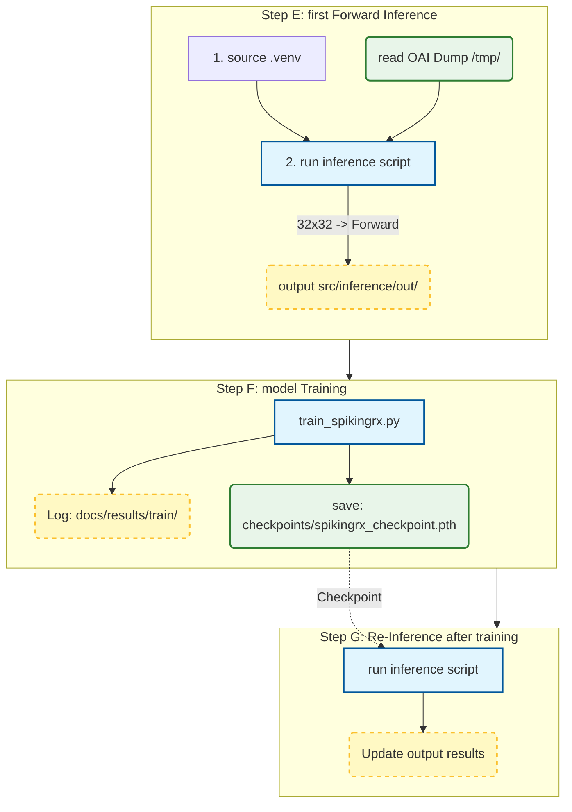

# OAI → Full-grid Dump → SpikingRx
## 1.dump
We need to take out the FFT data from OAI, add the code in `nr_dlsch_demodulation` ,this function will generate a OAI Full-grid dump.
```
#include <stdio.h>
#include <stdint.h>
// --- SpikingRx full-grid dump guard ---
static int spx_last_frame = -1;
static int spx_last_slot = -1;
// =====================================================
// === SpikingRx FULL-GRID DUMP (14 symbols × 2048 SC) ==
// =====================================================
{
 static uint32_t spx_dump_idx = 0; // 全域 index，自動遞增
 int frame = proc->frame_rx;
 int slot = proc->nr_slot_rx;
 char fname[256];
 snprintf(fname, sizeof(fname),
 "/tmp/spx_fullgrid_idx%06u.bin", spx_dump_idx);
 FILE *f = fopen(fname, "wb");
 if (f) {
 // ----- header -----
 uint16_t header[8];
 header[0] = (uint16_t)frame;
 header[1] = (uint16_t)slot;
 header[2] = 0; // start_symbol (unused)
 header[3] = fp->symbols_per_slot; // usually 14
 header[4] = fp->ofdm_symbol_size; // usually 2048
 header[5] = 0; // rx_ant=0
 header[6] = 0; // cw=0
 header[7] = 0; // reserved
 fwrite(header, sizeof(uint16_t), 8, f);
 int ofdm = fp->ofdm_symbol_size;
 int nsym = fp->symbols_per_slot;
 // dump 14 symbols × 2048 complex16
 for (int sym = 0; sym < nsym; sym++) {
 fwrite(&rxdataF[0][sym * ofdm], sizeof(c16_t), ofdm, f);
 }
 fclose(f);
 printf("FULLGRID_IDX=%u frame=%d slot=%d → %s\n",
 spx_dump_idx, frame, slot, fname);
 }
 spx_dump_idx++; // 每次 dump 完自動 +1
}
```
## 2.compile OAI（gNB + UE）and run
```
#clean the old one
cd ~/openairinterface5g/cmake_targets/ran_build/build
rm -rf CMakeCache.txt CMakeFiles
```
```
#rebuild 
cd ~/openairinterface5g/cmake_targets
sudo ./build_oai --gNB --nrUE -w SIMU
```
```
# run the oai-gnb 
cd ~/openairinterface5g
source oaienv
cd cmake_targets/ran_build/build
sudo ./nr-softmodem -O ../../../targets/PROJECTS/GENERIC-NR-5GC/CONF/gnb.sa.band78.fr1.106PRB.usrpb210.conf --rfsim --sa -E
```
```
# run the oai-nrue 
cd ~/openairinterface5g
source oaienv
cd cmake_targets/ran_build/build
sudo ./nr-uesoftmodem -r 106 --numerology 1 --band 78 -C 3619200000 --ssb 516 -E --rfsim --sa --uicc0.imsi 001010000000001 --rfsimulator.serveraddr 127.0.0.1

```
* before run gnb and ue, you need to open cn5g to get the full log. the link below shows how to config your cn5g and gnb in the same machine.
* https://github.com/bmw-ece-ntust/L-release-near-RT-RIC-/blob/master/gNB_UE_5gCN.md

After you finich  running, you can use the command to check the dump file. You will see something like this:
```
ls -ltr /tmp/spx_fullgrid_*.bin
```
```
-rw-r--r-- 1 root root 61440 十一 26 17:35 /tmp/spx_fullgrid_f0_s0.bin
```
# 3. SpikingRx



```
#1.env
cd ~/SpikingRx-on-OAI
source .venv/bin/activate
```
```
# 2. inference（read OAI dump automatically 、Convert format（32x32），make forward inferences ）
python src/inference/run_spikingrx_on_oai_dump.py
```

```
# 3.training
cd ~/SpikingRx-on-OAI
python src/train/train_spikingrx.py
#checkpointmodel will be in：
#checkpoints/spikingrx_checkpoint.pth
```
```
# 4.inference again
cd ~/SpikingRx-on-OAI
python src/inference/run_spikingrx_on_oai_dump.py
```
